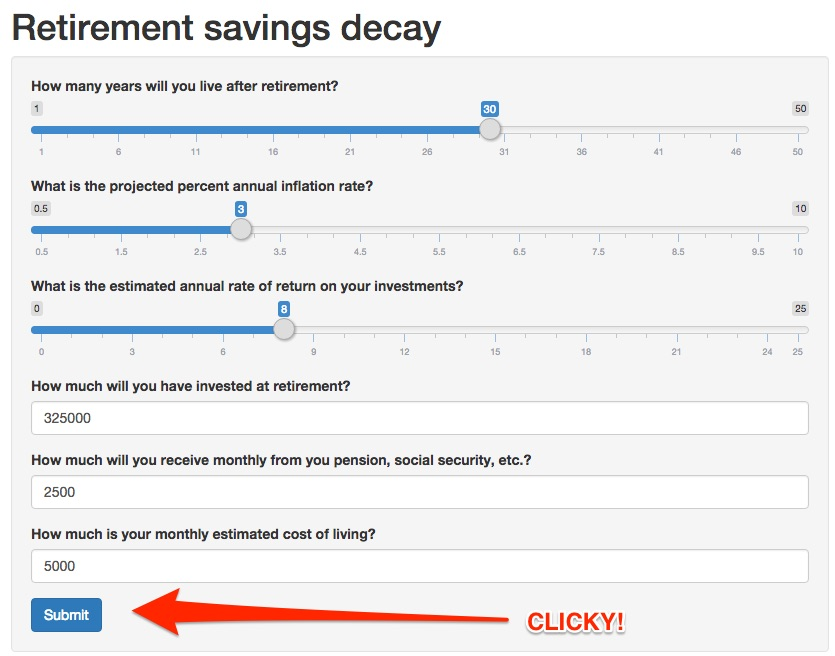

---
title       : Retirement savings decay
subtitle    : A shiny sales pitch
author      : 
job         : 
framework   : io2012        # {io2012, html5slides, shower, dzslides, ...}
highlighter : highlight.js  # {highlight.js, prettify, highlight}
hitheme     : tomorrow      # 
widgets     : [quiz, bootstrap]            # {mathjax, quiz, bootstrap}
ext_widgets : {rCharts: [libraries/nvd3]}
mode        : selfcontained # {standalone, draft}
knit        : slidify::knit2slides
--- &radio

## Why use the retirement savings decay application?

1. To understand how much money you need to retire.
2. To plan out your future retirement.
3. Because it is super cool.
4. _All of the above!_

*** .hint
Not 1, 2, or 3.

*** .explanation
It is clearly all of the above...I can't believe you needed an explanation for this!

--- .class #id

## First you enter in the parameters as shown below:




--- .class #id

## Then the algorithm does its thing.

```{r}
years <- 1:30; remains <- 325000; monthlyRev <- 2500; monthlyCost <- 5000; 
inflation <- 3; ror <- 8; remaining <- numeric()
for( i in years) {
        for( j in 1:12) {
            remains <- (remains + monthlyRev - monthlyCost*(1 + inflation/1200)) * (1 + ror/1200)
        }
        remaining[i] <- remains
}
df <- data.frame(year = years, remaining = remaining)
message <- "You can retire safely!"
if(min(df$remaining) <= 0) {
        dest <- min(df$year[df$remaining <= 0])
        message <- paste("You will be destitute in year", dest)
}
message
```


--- .class #id

## Also, a chart is created.

```{r echo = F, results = 'asis'}
library(rCharts)
n1 <- nPlot(remaining ~ year, type = "multiBarChart", data = df)
n1$chart(showControls = FALSE)
n1$yAxis(axisLabel = 'Retirement savings')
n1$xAxis(axisLabel = 'Year')
n1$print('chart1')
```

Kind of like the one above, but [way spiffier!](https://jamessul.shinyapps.io/dp_project)

